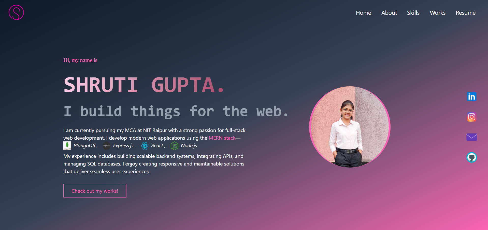
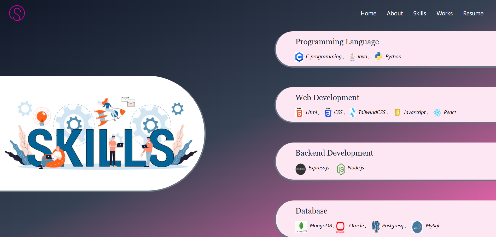
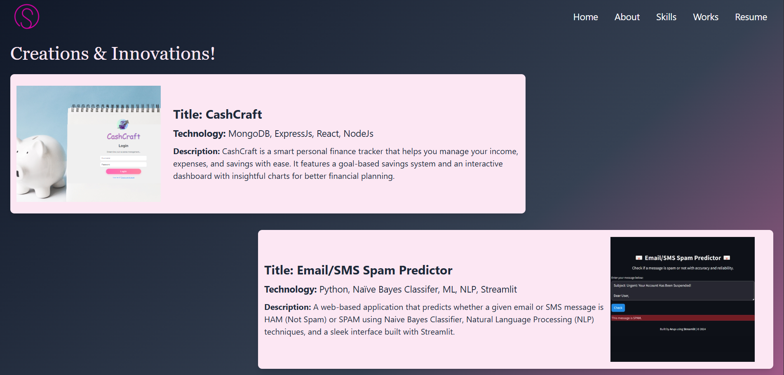
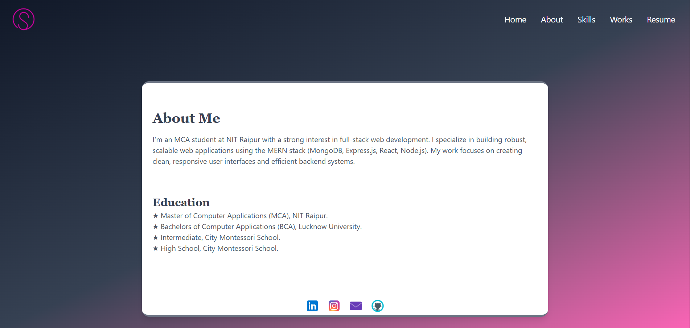

# Portfolio Website

A clean, modern, and fully responsive **personal portfolio website** built with **React** and **Tailwind CSS**. This project showcases my skills, work experience, and resume in a professional format to help you stand out to potential employers or clients.

---

## Live Demo

[🔗 Visit Live Site] [watch](https://my-portfolio-umber-ten-88.vercel.app/)

---

## Features

- 🎯 Home, About, Skills, Work, and Resume sections
- ⚡ Fast loading with optimized components
- 🎨 Modern UI using Tailwind CSS
- 💻 Clean and modular React component architecture
- 📄 Resume section with downloadable PDF
- 🔗 External links to GitHub, LinkedIn, etc.

---

## Tech Stack

| Technology     | Description                            |
|----------------|----------------------------------------|
| React          | JavaScript library for building UIs    |
| Tailwind CSS   | Utility-first CSS framework            |
| React Router   | For smooth page navigation             |
| Icons          | For visual enhancement                 |

---

## Folder Structure

src/ 
├── assets/ # Images, icons, and PDFs 
├── components/ # About, Skills, Work, Resume 
├── App.jsx # Main application component 
├── main.jsx # Entry point 
└── index.css # Tailwind CSS imports

---

## Sections Explained

### 🔹 About
Brief summary of who you are, your background, and your mission.

### 🔹 Skills
Showcase of technical and soft skills with visually distinct icons or progress bars.

### 🔹 Work
Projects I've completed, including descriptions and links to GitHub repositories.

### 🔹 Resume
Highlights of education, experience, and a downloadable resume link.

---

## Getting Started

### 1. Clone the repository

git clone https://github.com/Shruti2026/myPortfolio.git 
cd portfolio-website

### 2. Install dependencies

npm install

### 3. Start development server

npm run dev   # or `npm start` if using CRA

---

## Screenshots

*Home page*
  

*Skills page*
  

*Work page*
  

*About Me page*
  

## License

This project is licensed under the MIT License.

## Author

### Shruti Gupta
📧 gshruti779@gmail.com

## Acknowledgements
React

Tailwind CSS

Icons

