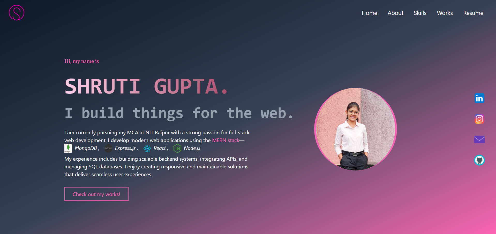
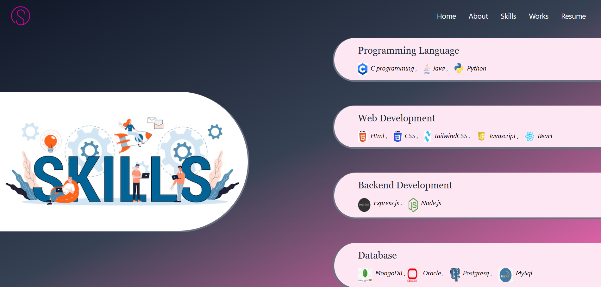
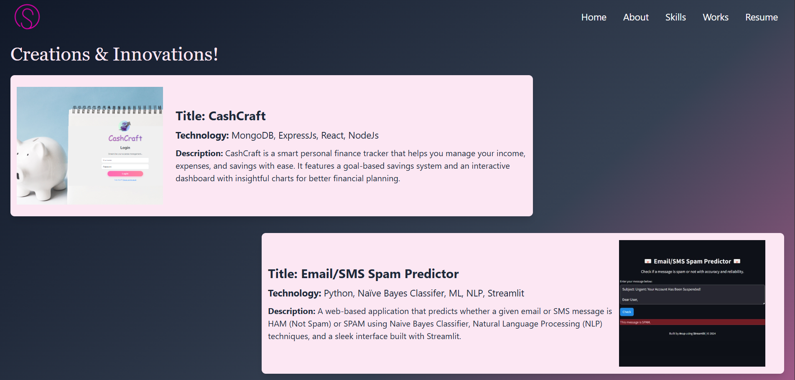
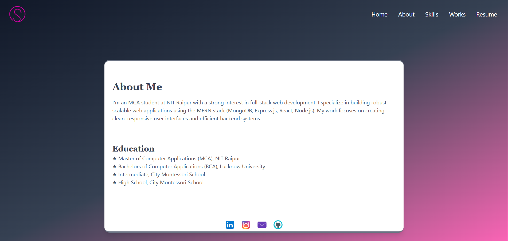

# Portfolio

Welcome to my portfolio repository! I'm a **Full-Stack Web Developer** specializing in the MERN stack and a MCA student at NIT Raipur. This portfolio showcases my skills, projects, and experiences using MongoDB, Express.js, React, Node.js, and more.

## Glimpse of My Portfolio

## 📌 Check out the live demo  
[Watch](https://www.linkedin.com/feed/update/urn:li:activity:7331713543118966784/)   

*Home page*
   

*Skills page*
   

*Work page*
   

*About Me page*
   

## Tech Stack

- **Frontend:** React, TailwindCSS

